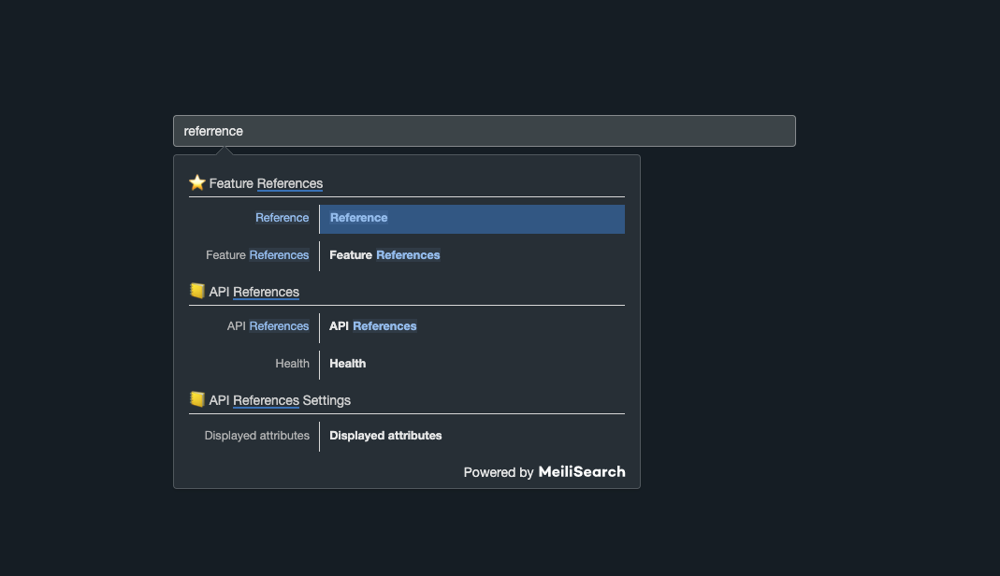

<p align="center">
  
</p>

<h1 align="center">docs-searchbar.js</h1>

<h4 align="center">
  <a href="https://github.com/meilisearch/meilisearch">Meilisearch</a> |
  <a href="https://docs.meilisearch.com">Documentation</a> |
  <a href="https://slack.meilisearch.com">Slack</a> |
  <a href="https://roadmap.meilisearch.com/tabs/1-under-consideration">Roadmap</a> |
  <a href="https://www.meilisearch.com">Website</a> |
  <a href="https://docs.meilisearch.com/faq">FAQ</a>
</h4>

<p align="center">
  <a href="https://www.npmjs.com/package/docs-searchbar.js"></a>
  <a href="https://github.com/meilisearch/docs-searchbar.js/actions"></a>
  <a href="https://github.com/meilisearch/docs-searchbar.js/blob/main/LICENSE"></a>
  <a href="https://app.bors.tech/repositories/28906"></a>
</p>

**docs-searchbar.js** is a front-end SDK for **Meilisearch** to handle your search bar documentation.

**Meilisearch** is an open-source search engine. [Discover what Meilisearch is!](https://github.com/meilisearch/meilisearch)


💡 If you use VuePress for your website, you should check out our [VuePress plugin for Meilisearch](https://github.com/meilisearch/vuepress-plugin-meilisearch).

## Table of Contents <!-- omit in toc -->

- [🔧 Installation](#-installation)
- [🎬 Getting Started](#-getting-started)
- [🎨 Customization](#customization)
- [🤖 Compatibility with Meilisearch](#compatibility-with-meilisearch)
- [⚙️ Development Workflow and Contributing](#development-workflow-and-contributing)
- [🥇 Credits](#credits)

## Installation

**With npm**:

We only guarantee that the package works with `node` >= 12 and `node` < 15.
```sh
# With NPM
npm install docs-searchbar.js
# With Yarn
yarn add docs-searchbar.js
```

**In your HTML**:

Add the following script into your `HTML` file:

```html
<script src="https://cdn.jsdelivr.net/npm/docs-searchbar.js@{version}/dist/cdn/docs-searchbar.min.js"></script>
```

### 🏃‍♀️ Run Meilisearch <!-- omit in toc -->

There are many easy ways to [download and run a Meilisearch instance](https://docs.meilisearch.com/reference/features/installation.html#download-and-launch).

For example, using the `curl` command in [your Terminal](https://itconnect.uw.edu/learn/workshops/online-tutorials/web-publishing/what-is-a-terminal/):

```bash
# Install Meilisearch
curl -L https://install.meilisearch.com | sh

# Launch Meilisearch
./meilisearch --master-key=masterKey
```

NB: you can also download Meilisearch from **Homebrew** or **APT** or even run it using **Docker**.

### Index your data <!-- omit in toc -->

The goal of this library is to provide a front-end search bar into your own documentation. To make that possible, you need to gather your website content in advance, and index it in a Meilisearch instance.

Luckily, we provide all the tools that you need, and can help you through the whole process, if you follow [this guide](https://docs.meilisearch.com/create/how_to/search_bar_for_docs.html) 🚀

Note: If you want to try out `docs-searchbar.js` as a first introduction, [try out our playground](./CONTRIBUTING.md#playground).

#### Use your own scraper <!-- omit in toc -->

We recommend using the [`docs-scraper` tool](https://github.com/meilisearch/docs-scraper) to scrape your website, but this is not mandatory.

If you already have your own scraper but you still want to use Meilisearch and `docs-searchbar.js`, check out [this discussion](https://github.com/meilisearch/docs-searchbar.js/issues/40).


### Getting Started

#### ES module <!-- omit in toc -->

Add an `input` tag with the attribute `id="search-bar-input` in one of your `HTML` file.

```html
<input type="search" id="search-bar-input" />
```

Then, import `docs-searchbar.js` and run the `docsSearchBar` function. For more explaination of the required parameters, see next section.
```js
import docsSearchBar from 'docs-searchbar.js'

docsSearchBar({
  hostUrl: 'https://mymeilisearch.com',
  apiKey: 'XXX',
  indexUid: 'docs',
  inputSelector: '#search-bar-input',
})
```

#### HTML <!-- omit in toc -->

Add the following code to one of your `HTML` files.
```html
<!DOCTYPE html>
<html>
  <head>
    <link
      rel="stylesheet"
      href="https://cdn.jsdelivr.net/npm/docs-searchbar.js@{version}/dist/cdn/docs-searchbar.min.css"
    />
  </head>

  <body>
    <input type="search" id="search-bar-input" />
    <script src="https://cdn.jsdelivr.net/npm/docs-searchbar.js@{version}/dist/cdn/docs-searchbar.min.js"></script>
    <script>
      docsSearchBar({
        hostUrl: 'https://mymeilisearch.com',
        apiKey: 'XXX',
        indexUid: 'docs',
        inputSelector: '#search-bar-input',
        debug: true, // Set debug to true if you want to inspect the dropdown
      })
    </script>
  </body>
</html>
```

The `hostUrl` and the `apiKey` (_optional_) fields are the credentials of your Meilisearch instance.<br>
`indexUid` is the index identifier in your Meilisearch instance in which your website content is stored.<br>
`inputSelector` is the `id` attribute of the HTML search input tag.

_Your documentation content is not indexed yet? Check out [this tutorial](https://docs.meilisearch.com/create/how_to/search_bar_for_docs.html)._

**WARNING: We recommend providing the Meilisearch public key, which is enough to perform search requests.<br>
Read more about [Meilisearch authentication](https://docs.meilisearch.com/reference/features/authentication.html).**

### Styling

`docs-searchbar.js` comes with a css template. It has to be added in your project in the following way:

In an ES+ environment:

```js
import 'docs-searchbar.js/dist/cdn/docs-searchbar.css'
```

In a `HTML` file, the `link` tag should be added in your header:

```html
<link
  rel="stylesheet"
  href="https://cdn.jsdelivr.net/npm/docs-searchbar.js@latest/dist/cdn/docs-searchbar.min.css"
/>
```

## 🎨 Customization

The default behavior of this library fits perfectly for a documentation search bar, but you might need some customizations.

- [Optional parameters](#optional-parameters-) (when calling `docsSearchBar` method)
- [Styling](#styling-) (with CSS)

### Optional parameters <!-- omit in toc -->

When calling the `docsSearchBar` method, you can add optional fields:

#### `queryHook` <!-- omit in toc -->

`queryHook` takes a callback function as value. This function will be called on every keystroke to transform the typed keywords before querying Meilisearch. By default, it does not do anything, but it is the perfect place for you to add some preprocessing or custom functionality.

#### `transformData` <!-- omit in toc -->

`transformData` takes a callback function as value. This function will be called on every hit before displaying them. By default, it does not do anything, but it lets you add any post-processing around the data you received from Meilisearch.

#### `handleSelected` <!-- omit in toc -->

`handleSelected` takes a callback function a value. This function is called when a suggestion is selected (either from a click or a keystroke). By default, it displays anchor links to the results page. Here is an example to override this behavior:

```javascript
docsSearchBar({
  // ...
  handleSelected: function (input, event, suggestion, datasetNumber, context) {
    // Prevents the default behavior on click and rather opens the suggestion
    // in a new tab.
    if (context.selectionMethod === 'click') {
      input.setVal('')

      const windowReference = window.open(suggestion.url, '_blank')
      windowReference.focus()
    }
  },
})
```

Note that, by default, you can already open a new tab thanks to the CMD/CTRL + Click action.

The function is called with the following arguments:

- `input`: a reference to the search input element. It comes with the `.open()`, `.close()`, `.getVal()` and `.setVal()` methods.

- `event`: the actual event triggering the selection.

- `suggestion`: the object representing the current selection. It contains a `.url` key representing the destination.

- `datasetNumber`: this should always be equal to 1 as `docs-searchbar.js` is searching into one dataset at a time. You can ignore this attribute.

- `context`: additional information about the selection. Contains a `.selectionMethod` key that can be either `click`, `enterKey`, `tabKey` or `blur`, depending on how the suggestion was selected.

#### `meilisearchOptions` <!-- omit in toc -->

You can forward search parameters to the Meilisearch API by using the `meilisearchOptions` key. Checkout out the [Meilisearch documentation about search parameters](https://docs.meilisearch.com/reference/features/search_parameters.html#search-parameters).

For example, you might want to increase the number of results displayed in the dropdown:

```javascript
docsSearchBar({
  meilisearchOptions: {
    limit: 10,
  },
})
```

#### `enableDarkMode` <!-- omit in toc -->

Allows you to display the searchbar in dark mode. It is useful if your website has dark mode support and you also want the searchbar to appear in a dark version.
You can always edit the style of the searchbar to match the style of your website. When the option `enableDarkMode` is set to `auto`, the searchbar automatically sets the mode to the system mode.

`enableDarkMode` has three possible states:
- `false`: enforce light mode.
- `true`: enforce dark mode.
- `auto`: system mode (light or dark).

Example:

```javascript
docsSearchBar({
  ...
  enableDarkMode: 'auto'
})
```

Dark mode with `enableDarkMode` set to `auto` and system mode set to `dark`:



#### `enhancedSearchInput` <!-- omit in toc -->

When set to `true`, a theme is applied to the search box to improve its appearance. It adds the `.searchbox` class which can be used to further customise the search box.

Example:

```javascript
docsSearchBar({
  ...
  enhancedSearchInput: true
})
```

##### More Examples <!-- omit in toc -->

Here is a basic [HTML file](playground/index.html) used in the playground of this repository.

As a more concrete example, you can [check out the configuration](https://github.com/meilisearch/vuepress-plugin-meilisearch/blob/main/MeiliSearchBox.vue#L60) applied in the Meilisearch plugin for VuePress.

#### Styling <!-- omit in toc -->

```css
/* Main dropdown wrapper */
.meilisearch-autocomplete .dsb-dropdown-menu {
  width: 500px;
}

/* Main category */
.meilisearch-autocomplete .docs-searchbar-suggestion--category-header {
  color: darkgray;
  border: 1px solid gray;
}

/* Category */
.meilisearch-autocomplete .docs-searchbar-suggestion--subcategory-column {
  color: gray;
}

/* Title */
.meilisearch-autocomplete .docs-searchbar-suggestion--title {
  font-weight: bold;
  color: black;
}

/* Description */
.meilisearch-autocomplete .docs-searchbar-suggestion--text {
  font-size: 0.8rem;
  color: gray;
}

/* Highlighted text */
.meilisearch-autocomplete .docs-searchbar-suggestion--highlight {
  color: blue;
}
```

**TIPS: When inspecting the dropdown markup with your browser tools, you should add `debug: true` to your `docsSearchBar` call to prevent it from closing on inspection.**

##### More Examples <!-- omit in toc -->

Here is the [CSS customization](https://github.com/meilisearch/vuepress-plugin-meilisearch/blob/main/MeiliSearchBox.vue#L82) applied in the Meilisearch plugin for VuePress.

## 🤖 Compatibility with Meilisearch

This package only guarantees the compatibility with the [version v0.25.0 of Meilisearch](https://github.com/meilisearch/meilisearch/releases/tag/v0.25.0).

## ⚙️ Development Workflow and Contributing

Any new contribution is more than welcome in this project!

If you want to know more about the development workflow or want to contribute, please visit our [contributing guidelines](/CONTRIBUTING.md) for detailed instructions!

## 🥇 Credits

Based on [Algolia DocSearch repository](https://github.com/algolia/docsearch) from [this commit](https://github.com/algolia/docsearch/commit/4c32b6f80b753f592de83351116664bf74b10297).<br>
Due to a lot of future changes in this repository compared to the original one, we don't maintain it as an official fork.

<hr>

**Meilisearch** provides and maintains many **SDKs and Integration tools** like this one. We want to provide everyone with an **amazing search experience for any kind of project**. If you want to contribute, make suggestions, or just know what's going on right now, visit us in the [integration-guides](https://github.com/meilisearch/integration-guides) repository.
